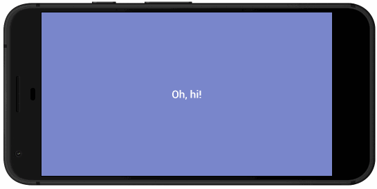

# Ripple

A [Framer](http://framerjs.com) module to easily add a ripple transition animation to any layer. The transition is widely referenced in Google's [Material Design](https://material.io/guidelines/motion/material-motion.html) system.




## Installation

1. Place the `Ripple.coffee` file in your Framer `/modules` directory.
2. At the top of your Framer prototype, reference the module with this line:

```coffeescript
R = require "Ripple"
```


## Usage

Create a ripple animation by calling `RippleTransition` and referencing a `<Layer>` to mask.

```coffeescript
LayerA.onTap ->

  R.RippleTransition
    layer: LayerA
    closeTo: {x: Screen.width, y: Screen.height}
```

### `closeTo` or `openFrom`

The `RippleTransition` function requires one of two variables to be set: `closeTo` or `openFrom`. The `closeTo` variable animates the mask layer inward, collapsing to a given point. The `openFrom` variable animates the mask layer outward, expanding from a given point.

Either variable needs to reference a `<Layer>` or an `Object` of `{x:n, y:n}`. Referencing a `<Layer>` will automatically grab the `midX` and `midY` points of the layer, collapsing or expanding the animation to its center.

### Examples:

```coffeescript
# On tap, a ripple open transition will start from
# the spot of the tap...

LayerA.on Events.Tap, (e) ->

  R.RippleTransition
    layer: LayerA
    openFrom: e.point

# On tap, a ripple close animation will collapse
# to the center of layerB...

LayerA.on Events.Tap, (e) ->

  R.RippleTransition
    layer: LayerA
    closeTo: layerB
```


## How it works

Calling `RippleTransition` places the referenced '<Layer>' inside of a mask layer. Once the mask animation is complete, the `<Layer>` is removed from the mask layer and the mask is destroyed. Any properties of `<Layer>` are maintained.
